# Demo 2, as a sequence

One participant per party, one message per act a beat comprises, and the events between beats as notes. **Collapsed on purpose** — the record commits 53 events, and a diagram with one arrow each would be unreadable and would say less than `utina log` already says in a table (`this.i` @y7ytqzyj).

The live seventeen come first, grouped by kernel in playing order, then the six leave-behind beats. Generated by `tools/render-demo-2.py` and pinned by `tests/test_demo_2_artifacts.py`: edit the driver or the record, never this file.

```mermaid
sequenceDiagram
    autonumber
    participant Acme as acme-governed-domain,6
    participant Marta as marta-founder,6
    participant Dev as dev-founder,6
    participant Seat3 as nina-board-seat-3,6
    participant Device as nina-board-seat-3-device,6
    participant Quinn as quinn-cfo,6
    participant Meridian as meridian-governed-domain,6
    participant Priya as priya-officer,6
    participant Tomas as tomas-officer,6
    Note over Acme,Quinn: The amendment as hinge
    Note right of Acme: beat 7 — Seat the board: the amendment itself (d4, seq 15)
    Marta->>Acme: endorse the amendment that seats the board
    Dev->>Acme: endorse
    Acme->>Acme: certify: the board law takes force here
    Note over Acme,Quinn: What the amendment did to two pending acts
    Note right of Acme: beat 9 — The hire, re-asked after the amendment (board-seated, seq 15)
    Acme->>Acme: re-ask the hire: its cure path was shut by the amendment
    Note right of Acme: beat 10 — The equity release, re-asked after the amendment (board-seated, seq 15)
    Acme->>Acme: re-ask the equity release: its cure path is still open
    Note over Acme,Quinn: Same signed no, two answers
    Note over Acme,Quinn: meanwhile: 18 events committed, 2 of them certifications
    Note right of Acme: beat 13 — The Q2 forecast, after Dev declines (b13, seq 33)
    Marta->>Acme: endorse the Q2 forecast
    Dev->>Acme: decline — but seat 3's slot is still reachable
    Note over Acme,Quinn: Two currents, unmerged
    Note right of Acme: beat 8 — Board seat 3, and the two bindings that make it an office (b8, seq 16)
    Acme->>Seat3: seat credential, issued under Acme's registry
    Note over Acme,Quinn: meanwhile: 6 events committed, 2 of them certifications
    Note right of Acme: beat 12 — The annual budget, on two slots of three (d5, seq 22)
    Marta->>Acme: endorse the budget
    Seat3->>Acme: endorse, citing the seat credential
    Acme->>Acme: certify
    Note right of Acme: beat 14 — Quinn endorses without a seat (live, nothing committed)
    Quinn->>Acme: endorse citing a seat he does not hold — refused
    Note over Acme,Quinn: Revocation, and what it cannot do
    Note over Acme,Quinn: meanwhile: 15 events committed, 1 of them certifications
    Note right of Acme: beat 16 — Acme revokes the seat credential (b16, seq 37)
    Acme->>Acme: revoke the seat credential
    Note over Acme,Quinn: meanwhile: 2 events committed
    Note right of Acme: beat 17 — The Q3 budget, a new question after the revocation (b17, seq 39)
    Marta->>Acme: endorse the Q3 budget
    Note right of Acme: beat 19 — Beat 12's question, re-asked after the revocation (b17, seq 39)
    Acme->>Acme: re-ask beat 12: the credential did stand at that position
    Note over Acme,Quinn: meanwhile: 9 events committed, 1 of them certifications
    Note right of Acme: beat 20 — Duplicity at seat 3's signing position (b20, seq 48)
    Acme->>Acme: admit an observed duplicity at seat 3's signing position
    Note over Acme,Quinn: What a rule change costs
    Note right of Acme: beat 22 — The second amendment: lower the ordinary-acts bar (b22, seq 47)
    Marta->>Acme: endorse the second amendment
    Dev->>Acme: endorse
    Seat3->>Acme: endorse
    Acme->>Acme: certify
    Note right of Acme: beat 23 — The three decisions that can now never finish (b23, seq 47)
    Acme->>Acme: compute which acts in flight the amendment ended
    Note over Acme,Quinn: A certification that lies
    Note over Acme,Quinn: meanwhile: 5 events committed, 1 of them certifications
    Note right of Acme: beat 26 — Marta certifies an act that never carried (b26, seq 52)
    Marta->>Acme: endorse the equity release, tabled again
    Dev->>Acme: decline
    Marta->>Acme: certify, citing her own half at full weight
    Acme->>Acme: admit it: the cited weights do add to one
    Note over Acme,Quinn: Governance that composes
    Note right of Acme: beat 27 — Meridian Bank's law obliges it to look (live, nothing committed)
    Meridian->>Meridian: commit a law obliging diligence on a counterparty
    Note right of Acme: beat 28 — Both officers sign, and it is still not enough (live, nothing committed)
    Priya->>Meridian: endorse opening the account
    Tomas->>Meridian: endorse
    Meridian->>Meridian: certify — and it is still not authorized
    Note right of Acme: beat 29 — Meridian folds Acme's log, and shows you the fold (live, nothing committed)
    Acme->>Meridian: Acme's committed record, as far as beat 2's coordinate
    Meridian->>Meridian: commit what was checked: whose, where, which clause
    Meridian->>Meridian: refold Acme's log now, from Meridian's own record
    Note over Acme,Quinn: The leave-behind, sent afterwards
    Note right of Acme: beat 11 — The equity release, cured across the amendment (b11, seq 18)
    Dev->>Acme: endorse the equity release, on the far side of the amendment
    Acme->>Acme: certify: cured under the clause that never moved
    Note over Acme,Quinn: meanwhile: 18 events committed, 2 of them certifications
    Note right of Acme: beat 15 — Nina endorses from her delegated device (b15, seq 36)
    Device->>Acme: endorse the forecast, citing the seat credential
    Acme->>Acme: certify
    Note right of Acme: beat 18 — Beat 12's question, re-asked at beat 12's own position (d5, seq 22)
    Acme->>Acme: re-ask beat 12 at beat 12's own position: byte-identical
    Note over Acme,Quinn: meanwhile: 19 events committed, 1 of them certifications
    Note right of Acme: beat 21 — The capital plan (b21, seq 41)
    Marta->>Acme: endorse the capital plan
    Note right of Acme: beat 24 — The first decision, re-asked from the end of the record (d9, seq 30)
    Acme->>Acme: re-ask beat 2 from the end: still affirmed, still under A1
    Note right of Acme: beat 25 — Refold the whole log in permuted arrival order (board-seated, seq 15)
    Acme->>Acme: refold in permuted arrival order: byte-identical
```

